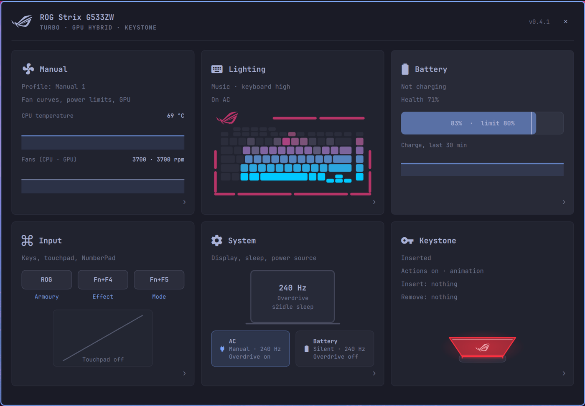
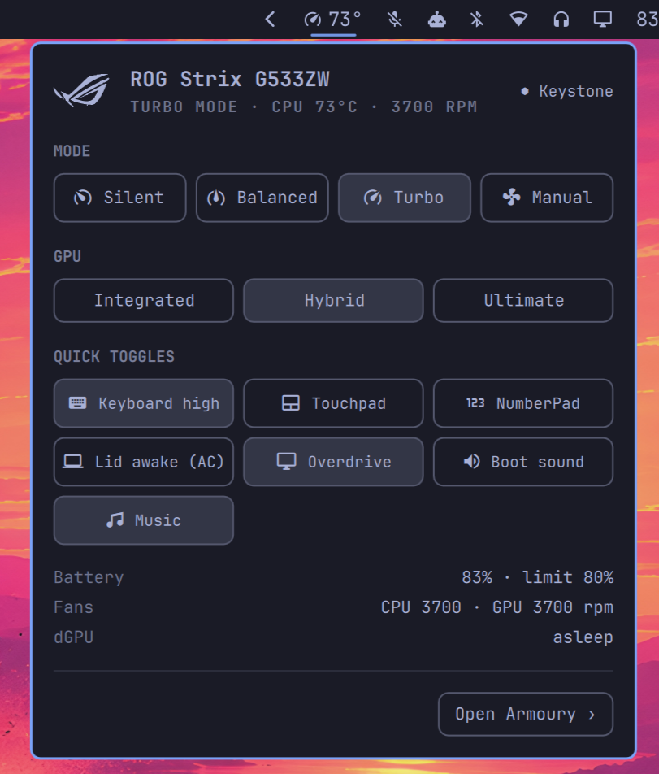

# omarchy-armoury

ASUS ROG control for [Omarchy](https://omarchy.org): a replacement for G-Helper,
built into the Omarchy bar. It has a bar widget and a settings window (the
`io.github.siddid-soni.armoury` Omarchy plugin), backed by three Rust programs: a daemon
(`armouryd`), a CLI (`armoury`) and a small root helper (`armoury-root`).
Design notes: `docs/superpowers/specs/`. Open follow-ups: `docs/superpowers/backlog.md`.

## Features

### Bar widget and popup

- The bar shows the current performance mode and, optionally, CPU temperature.
- The popup has:
  - **Mode**: Silent, Balanced, Turbo, Manual.
  - **GPU mode**: Integrated, Hybrid, Ultimate. It asks for confirmation and takes effect after a reboot.
  - **Quick toggles**: keyboard brightness, touchpad, NumberPad, lid-closed-awake on AC,
    panel overdrive, boot sound, music lighting.
  - A battery, fan and dGPU summary, plus a shortcut to the window.

### Window

- **Dashboard**: one tile per area.
  - Live graphs of CPU temperature, fan speeds and power draw.
  - A battery bar with a marker at the charge limit, and a charge trend.
  - A keyboard preview of the current lighting, live during Music.
  - Key bindings, the touchpad and NumberPad state, the display and power-source rules,
    and the Keystone.
- **Manual (performance)**: saved profiles, each built on a firmware mode.
  - Fan curves for each fan: drag points to edit, Shift-drag moves the whole curve.
  - PL1/PL2 power limits, CPU boost and energy preference.
  - Intel undervolt, when the BIOS allows it.
  - NVIDIA Dynamic Boost, temperature target, and core/memory clock offsets.
  - Live GPU status, including what is keeping the dGPU awake.
- **Lighting**:
  - Keyboard brightness, remembered separately on AC and on battery.
  - Firmware effects with colours, speed and direction.
  - Per-zone power (keyboard, lightbar, logo, lid) for boot, awake, sleep and shutdown.
- **Music effect**: the keyboard reacts to whatever is playing.
  - Spectrum (bass to treble, left to right) or Pulse (everything follows loudness).
  - Gradient, rainbow or single colour, with a sensitivity setting.
  - Pick *Music* in the effect list, or reach it with Fn+F4.
- **Battery**: charge, health, cycles, voltage, draw and time left. Charge limit, plus
  a one-shot "charge to 100%".
- **Input**:
  - Bind the ROG key, Fn+F4 and Fn+F5 to open Armoury, cycle mode, keyboard
    brightness or effect, toggle the NumberPad or music, or run a command.
  - Touchpad toggle.
  - NumberPad: touchpad number keys with a backlight, toggled by holding the corner.
- **System**:
  - Refresh rate and performance mode, set separately for AC and for battery.
  - Panel overdrive, gamma, sleep mode (s2idle/deep), lid closed on AC, boot sound.
- **Keystone**: actions for insert and for remove.
  - Performance mode.
  - Lighting: an effect, Music, or back to what was on before the insert.
  - A command.
  - Lock the screen, on remove only.
  - The Keystone light flashes on insert. One switch turns it all off.

### Daemon

- The OSD shows keyboard-brightness changes (Fn+F2/F3) and the mode key.
- Mode switches are serialized, one at a time, and stock modes send only the firmware
  policy change. Rapid firmware calls hung the embedded controller on the G533ZW.
- Installing puts armouryd in control and starts asusd. If G-Helper is installed, it's
  stopped and its autostart is blocked. Uninstalling gives control back.

### CLI

`armoury status`, `profile`, `manual`, `undervolt`, `gpu`, `light`, `kbd`, `music`,
`numpad`, `keys`, `battery`, `display`, `toggle`, `sleep`, `auto`, `keystone`,
`watch`. `armoury <command> --help` has the details.

## Hardware support

Built and tested on a **ROG Strix SCAR 15 G533ZW** (i9-12900H, RTX 3070 Ti, per-key
RGB, NumberPad, Keystone). Features check what the hardware offers and only show what
exists, but only the G533ZW has been tested.

| Area | Works on | Notes |
|---|---|---|
| Modes, fan curves, charge limit, overdrive, boot sound, keyboard brightness and effects | ASUS laptops supported by **asusd** | Only what asusd reports is shown |
| Power limits, NVIDIA Dynamic Boost and temperature target | Laptops with the `asus-nb-wmi` attributes | Hidden when absent |
| GPU switching | **supergfxd**, plus Omarchy's hybrid-GPU toggle | Each switch needs a reboot; Integrated ↔ Ultimate goes through Hybrid (two reboots) |
| Undervolt | Intel CPUs with an unlocked voltage MSR | BIOS-locked on the G533ZW, so it's shown as unavailable |
| NVIDIA clocks and GPU status | NVIDIA dGPUs (NVML) | |
| ROG key, Fn+F4, Fn+F5 | Models whose hotkeys come through `asus-nb-wmi` | Key codes captured on the G533ZW |
| Keystone actions | Models with `/sys/devices/platform/asus-nb-wmi/keystone` | |
| **Music effect, Keystone light** | **G533 per-key layout only** | Other keyboards need an LED map in `features/music/perkey.rs` |
| **NumberPad** | **G533 touchpad layout only** (ASUE1403 04F3:319A) | Layouts are data tables in `features/numpad/layout.rs` |
| **asusd zone fix** | **G533Z only** | asusd's model database under-reports its lighting zones |
| Desktop integration | **Omarchy** (Hyprland, omarchy-shell) | Uses Omarchy's OSD, lock, touchpad and lid tools |

Adding a model usually means adding data (an LED map, a NumberPad layout, an asusd
zone fix), not code.

## Known issues

- **Light bar under the display during Music.** In per-key mode it copies the F5 and
  Delete colours. Armoury Crate on Windows controls it separately, so there's another
  packet; a USB capture from Windows is needed (steps in the backlog).
- **Keystone reacts within 2 s**, not instantly. The firmware sends no event, so its
  presence is read every 2 s. Keystones can't be told apart yet: the NFC reader
  (NXP3001) has no Linux driver bound.
- **Setting an effect or cycling Fn+F4 turns Music off.** Leaving Music restores the
  previous effect.
- **The lighting preview is an approximation** of the firmware effects, especially the
  reactive ones (Highlight, Laser, Ripple), which are shown answering simulated key presses.
- **GPU switching needs reboots.** Integrated ↔ Hybrid and Hybrid ↔ Ultimate take one
  reboot each. Integrated ↔ Ultimate has no direct path: it's two steps through Hybrid,
  so two reboots.
- **The asusd zone fix edits a package file** (`/usr/share/asusd/aura_support.ron`). A
  pacman hook re-applies it after every asusctl upgrade, and it regenerates asusd's
  lighting config, which resets the effect once.

## Install

Needs Omarchy, **asusd** (asusctl), **supergfxd** (supergfxctl) and PipeWire.

    omarchy plugin add https://github.com/Siddid-Soni/omarchy-armoury.git --enable

Then click the Armoury icon in the bar and press **Set up**. That opens a terminal
running the plugin's `install.sh`, which sets up the daemon.

- **Binaries:** it downloads the prebuilt binaries for this version from the GitHub
  release and checks them against the sha256 committed in `packaging/release.sha256`, not
  one downloaded with them. A mismatch falls back to building from source.
  - If there's no release for this version, or you pass `--build`, it builds them with
    cargo instead. That needs Rust, and the build goes to `~/.cache/omarchy-armoury`.
- **Questions it asks:**
  - it lists what it installs and asks before starting, then asks for sudo once (see
    *What it installs*)
  - before adding the SUPER+W line to your `bindings.lua`
  - before stopping G-Helper, if it's installed
- **At the end**, armouryd takes control and starts asusd.

You can also run it directly: `~/.config/omarchy/plugins/io.github.siddid-soni.armoury/install.sh`.

## Usage

- Click the bar icon for the popup (mode, GPU, quick toggles). Press *Open Armoury* or
  the ROG key for the full window.
- `armoury status` shows what the daemon sees; `armoury --help` lists the commands.
- Move the widget: `omarchy bar move io.github.siddid-soni.armoury --section right`.

## Update

    omarchy plugin update io.github.siddid-soni.armoury

After an update, the popup notices that the daemon is older than the plugin and offers
**Update**, which reruns `install.sh`.

## Remove

    ~/.config/omarchy/plugins/io.github.siddid-soni.armoury/uninstall.sh
    omarchy plugin remove io.github.siddid-soni.armoury

`uninstall.sh` gives control back (asusd stopped and its mask restored, G-Helper
restarted if you have it), restores asusd's model file, and removes everything below.

## What it installs (privilege boundaries)

The plugin itself is QML running in the Omarchy shell; it only talks to armouryd over a
Unix socket (`$XDG_RUNTIME_DIR/armoury.sock`). Everything else comes from `install.sh`:

- **User files**:
  - `~/.local/bin/armouryd`, `~/.local/bin/armoury`
  - the `armouryd` user service
  - `~/.config/omarchy-armoury/config.toml`
  - `~/.config/hypr/omarchy-armoury.lua`, plus one line in `bindings.lua` (SUPER+W closes
    the window), added only if you say yes
  - a drop-in that keeps G-Helper from autostarting while armouryd is in control (asked
    first, if G-Helper is installed)
- **Root helper**: `/usr/local/lib/omarchy-armoury/armoury-root`, run through `pkexec`.
  - A polkit rule lets *your user* run it **without a password**.
  - It only has a fixed set of commands, and it re-checks every argument:
    - start or stop asusd (`takeover` / `handback`)
    - patch or restore asusd's model file
    - power limits and CPU boost
    - NVIDIA clocks
    - the kernel sleep mode
    - Intel undervolt
- **udev rules** (`/etc/udev/rules.d/70-omarchy-armoury.rules`): give the logged-in
  seat user access (`uaccess`, nothing world-writable) to:
  - the ASUS keyboard's key events and lighting device (hidraw)
  - the touchpad and its i2c bus (NumberPad)
  - `/dev/uinput`
- **Kernel module**: `i2c-dev` loaded at boot (`/etc/modules-load.d/`), for the NumberPad light.
- **pacman hook**: re-applies the asusd model-file fix after asusctl upgrades.
- **asusd**: unmasked and started (its own udev rule starts it at boot).
- **Audio**: the Music effect records the default output's audio with `pw-record` while
  it runs. The audio is analysed in memory only, never stored or sent.

`install.sh` downloads the release binaries from this repository's GitHub releases
(checked against a sha256 committed in this repository). Nothing else is downloaded, and armouryd makes no network connections.
